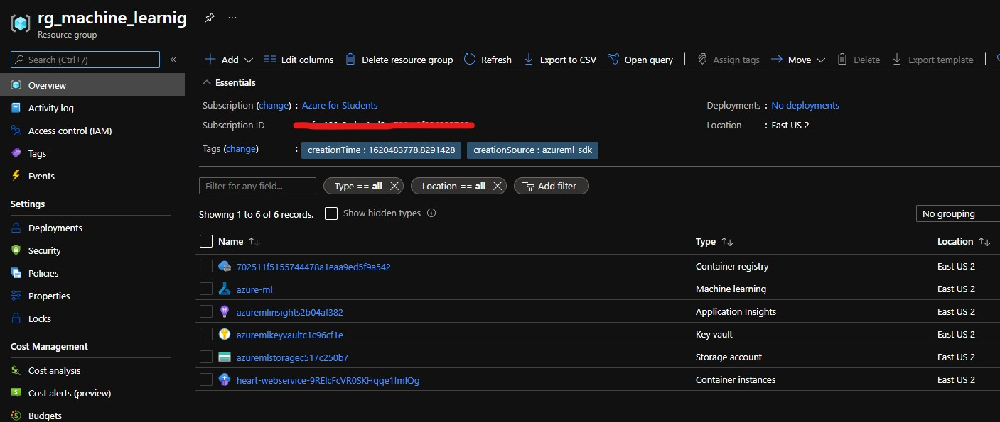

## Cloud - Especialización en analítica y ciencia de datos.

Presentado por: Edward Nicolas Montoya Arcila - Yeison Villamil

Ejemplo de despliegue de modelo de machine learning. El objetivo de este proyecto es desplegar un servicio web en la nube pública de azure mediante AzureML. Este servicio es capaz de predecir si una persona es propensa a sufrir un ataque al corazón basados en variables de salud globales. Los datos fueron tomados de Kaggle en el siguiente link: https://www.kaggle.com/rashikrahmanpritom/heart-attack-analysis-prediction-dataset.

## Descripción de los datos

- Age : Edad del paciente
- Sex : Sexo del paciente
- exang: Ejercicio inducido de angina
- ca: Número de vasos sanguineos
- cp : Tipo de dolor en el pecho
  - Value 1: Angina tipica
  - Value 2: Angina atipica
  - Value 3: Sin dolor
  - Value 4: Asintomatico
- trtbps : presión arterial en reposo  (in mm Hg)
- chol : colestoral en mg / dl obtenido a través del sensor de IMC
- fbs : (glucemia en ayunas > 120 mg/dl) (1 = Si; 0 = No)
- rest_ecg : resultados electrocardiográficos en reposo
  - Value 0: normal
  - Value 1: Tiene una anomalía de la onda ST-T (inversiones de la onda T y / o elevación o depresión del ST de> 0,05 mV)
  - Value 2: Muestra hipertrofia ventricular izquierda probable o definitiva
- thalach : frecuencia cardíaca máxima alcanzada
- target : 0= Baja posibilidad de ataque al corazón 1= Alta posibilidad de ataque al corazón.


## Requerimientos

- Subscripción de Azure.
- Docker, solo para ambiente local, recomendado para procesos de debug.
- Conda y Python 3.8 - ``` conda create -n azure-deploy python=3.8 ```
- IDE vs code o equivalente.

## ¿Cómo ejecutarlo?

- Crear un nuevo ambiente de conda.
- Instalar las siguientes dependencias

```bash
pip install azureml-core
pip install azureml
pip install azureml-contrib-services
pip install numpy
pip install pandas
pip install scikit-learn
```

- Ejecutar el primer script de creación del ambiente 

```bash
python ./01-create-environment.py
```

- Seguir los pasos de autenticación interactiva y esperar a que el script nos aprovisione con un entorno de machine learning. Al finalizar dentro de una carpeta llamada .azureml debe existir un archivo configuración con los parámetros del equipo.

NOTA: Si se quiere es posible usar azure cli para no tener que gestionar la autenticación desde el archivo local de configuración.

- La configuración despues del primer script debe generar los siguientes recursos dentro del grupo: Azure Machine Learning, Container registry, Application Insights, Key Vault, Storage Account.



- Ejecutar el segundo script para aprovisionar el entorno de Machine Learning con un cluster para gestionar la computación. Una vez finalice el script debe aparecer en la pestaña de computo del panel general de machine learning un nuevo cluster con el nombre: cpu-cluster


- Ejecutar el tercer script despues de validar que los datos a cargar se encuentren en la carpeta data.


- Ejecutar el cuarto script para entrenar el modelo, los parámetros disponibles son:

  - solver = Indica el parámetro solver para la Regresión Logistica.
  - random_state = Indica el estado de aleatoriedad con el cual inicia la regresión logistica.


- Ejecutar el quinto script con los datos del modelo a desplegar.

  - model_name = Nombre del modelo en AzureML.
  - model_version = Versión del modelo en AzureML.

